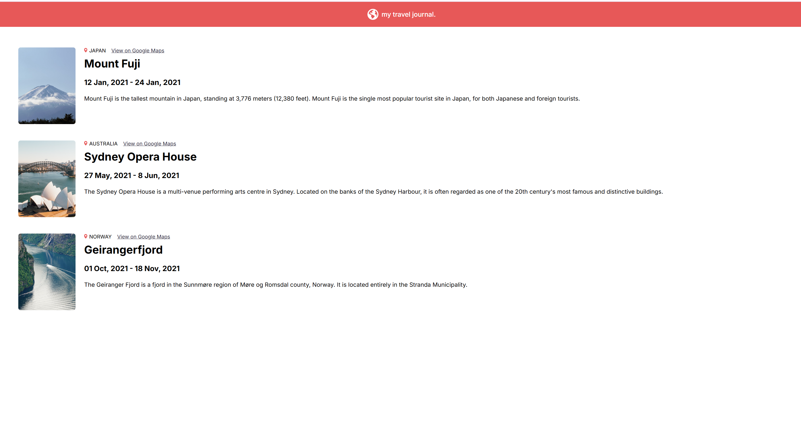

# TravelLogBook

TravelLogBook is a simple React app for logging and sharing your travel experiences around the world. Add entries for each destination, including photos, dates, descriptions, and a link to the location on Google Maps.


## Demo
)

## Getting Started

1. **Install dependencies:**
	```
	npm install
	```
2. **Run the app locally:**
	```
	npm run dev
	```
3. Open [http://localhost:5173](http://localhost:5173) in your browser.

## Project Structure
- `App.jsx` — Main app component
- `components/` — Contains `Header` and `Entry` components
- `data.js` — Sample travel entries
- `images/` — App images and icons

## Built With
- [React](https://react.dev/)
- [Vite](https://vitejs.dev/)

## Customization
To add your own travel entries, edit the `data.js` file and add objects to the exported array.

## License
This project is for learning and personal use.
